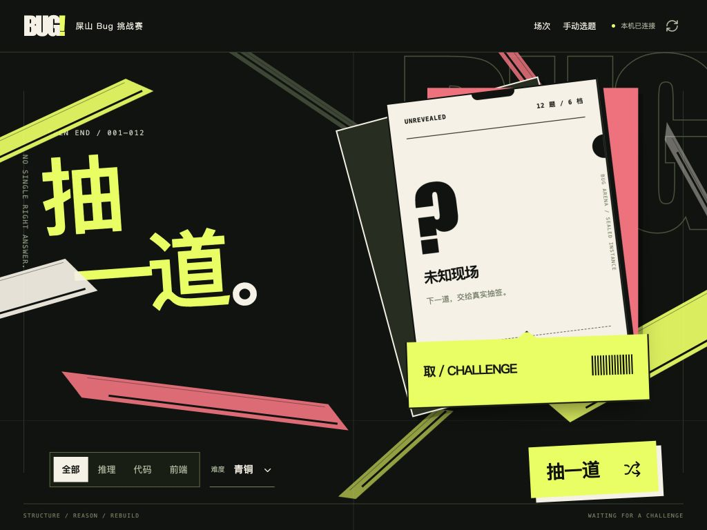

# 屎山 Bug 挑战赛 · v0.2 Extreme

**统一12题：R1–R4、C1–C4、F1–F4。每题的 full 规格都有至少10倍的实际规模维度，并加入需要跨阶段推理的机制。**

主流程是：**选择题池与难度 → 抽题、揭晓并冻结任务 → Agent 读取 README 解题 → 答案统一封存 → 独立检验与 Codex 复核 → 质量与效率分别计分。**

[实验说明](experiments/README.md) · [Codex评分说明](experiments/GRADER_README.md) · [时间与token计分](experiments/EFFICIENCY.md) · [难度与实际证据](docs/EXTREME_V02.md) · [GitHub Actions](https://github.com/zhu607705-coder/shit-mountain-benchmark/actions/workflows/verify.yml)



## 一键打开实战比赛

```bash
git clone https://github.com/zhu607705-coder/shit-mountain-benchmark.git
cd shit-mountain-benchmark

python3 scripts/launch_arena.py
```

macOS 也可直接双击仓库内的 **`启动挑战赛.command`**。进入抽题舞台后，选择全部/推理/代码/前端题池与 **青铜、白银、黄金、钻石、王者、噩梦** 六档之一，点击“抽一道”。服务器从题池中随机选题，画面随后揭晓；“开始这题”进入材料、提交与检验。手动选题和历史场次保留在次级入口。详细规则见 [难度划分与抽签](arena/DIFFICULTY.md)。

抽签生成本场比赛的公共 README 和三个任务段，分别规定诊断、实现、整体验证要交付什么。档位会改变检查范围、规模、案例数与预算；公共页面只显示承诺指纹，私有抽样种子保存在组织者目录。同一场中的所有参赛者共用冻结后的实例和规则。难度推荐是基于机制的初始划分，尚未使用多模型实测通过率校准。

Agent 完成后，把答案目录路径与入口填回界面并封存，再点击检验。页面显示实际通过项、失败项、原始分、同场相对分和待评项。**相对分为 100 不代表绝对完成；全场原始分均为 0 时不发满分。** 前端语义通过与完整 UI 验收分别展示，需要独立核验的内容可交给 Codex 评分说明继续处理。

比赛文件保存于 `reports/arena/`，不会提交到 GitHub。当前启动器用于本机可信实验，代码隔离边界见下方说明。

页面使用仓库内保存的 [Lucide 官方 SVG](https://lucide.dev/icons/)；图标源码版本、逐文件哈希和许可证见 [来源清单](arena/web/icons/SOURCE.json)。新版入口采用几何切面、波普排字和鼠标响应的抽签卡片，设计参考与实现边界见 [舞台设计记录](docs/plans/2026-09-26-draw-stage.md)。规则说明折叠到详情与 README，运行时不依赖 CDN。

## 批量实验：把 README 交给 Agent

需要系统比较多提示词、多轮结果时，可使用下面的批量入口：

```bash

# 复制plan.example.json修改实验id、题目、提示词、轮数和预算后执行
python3 scripts/experiment.py prepare \
  --plan experiments/plan.example.json \
  --output workspaces/experiments/extreme-v02-study-001
```

把生成的 `workspaces/experiments/extreme-v02-study-001/README.md` 交给答题 Agent。示例为 **12题×3种提示词×3轮=108次独立尝试**，不是已经调用了108次模型。每题只导出一份公共输入；各attempt有独立工作位置，开始时才复制必要文件。

答案先写到 `answers/<attempt-id>/work/`，组织者统一封存。不同轮次/提示词使用新会话，不沿用前一次答案。私有seed、预登记信息和评分结果在主办方 `reports/experiments/<id>/`，不会交给答题 Agent。

```bash
python3 scripts/experiment.py submit --workspace <workspace> \
  --attempt R1-direct-r01 --source /path/to/policy.py \
  --metrics /path/to/metrics.json

python3 scripts/experiment.py inspect --workspace <workspace>

# 由评分方 Codex 执行，不信选手自报的pass
python3 scripts/experiment.py grade --workspace <workspace> --attempt R1-direct-r01

python3 organizer/aggregate_experiment.py --workspace <workspace> \
  --model <model-id> --output reports/aggregate.json
```

目录型提交用 `--entrypoint .` 或题面指定入口。提交不会执行代码，封存后拒绝覆盖并检查文件与私有收据指纹；评分在新副本调用真实裁判。缺交/损坏/非法解为0，待评为null，采用同一封存答案最早完成的有效评分记录，不挑最好一次。

## 十二题的升级

| 题号 | 实际full规模 | 额外推理链 |
|---|---|---|
| [R1](reasoning/R1/PROMPT.md) | 576任务，12× | 逐阶段信息→不可逆投资→取消回收→跨链质量与相关天气 |
| [R2](reasoning/R2/PROMPT.md) | 1,800世界/180实验，10× | 零即时信息的准备→测量改变系统→漂移校准→尾部风险 |
| [R3](reasoning/R3/PROMPT.md) | 128组件，12.8×；960事故，10.67× | 单步无信息探针→互补检查→共享噪声校准→双故障预算 |
| [R4](reasoning/R4/PROMPT.md) | 720任务，12× | 低价值前驱生产耗材→维护/磨损→故障耗材损失→在线重排 |
| [C1](code/C1/PROMPT.md) | 20租户/20worker/80请求并发，10× | 逻辑幂等与物理epoch分离，提交丢ACK后迁移重试不能双扣 |
| [C2](code/C2/PROMPT.md) | 5,000节点/2,000深度，10× | 取消旧图→恢复槽→新图版本→发布不能借用旧快照 |
| [C3](code/C3/PROMPT.md) | 288故障历史，72×；100k键 | 旧压缩准备→writer换代→新ACK/删除→迟到发布不能回退 |
| [C4](code/C4/PROMPT.md) | 20root/1,000变更，10×；5,000节点 | 源与环境必须来自一致manifest cut，build中变更不能混合发布 |
| [F1](frontend/F1/PROMPT.md) | 100,000记录，10× | 多流版本→身份别名→独立确认→选中/焦点/URL联动 |
| [F2](frontend/F2/PROMPT.md) | 1,200任务，100×；117k递送 | 离线字段合并→新全局约束冲突→因果撤销→迁移恢复 |
| [F3](frontend/F3/PROMPT.md) | 500,000记录，10×；100k更新 | 暂停快照→迟到消息→墓碑回收/epoch→全量导出一致性 |
| [F4](frontend/F4/PROMPT.md) | 1,200任务，100×；117k递送 | 精确因果/并发→跨字段冲突→补偿撤销→删除与显式恢复世代 |

这里的倍数是可核对的负载/状态空间指标，**不是“智力难度提高10倍”的测量，也不保证任何模型必然做不出来**。新版提供独立小见证：单步没信息而多步有价值、合法局部选择导致更差全局结果，以及单机制通过但组合失败的真实文件/SQLite案例。代码深链递归报错单列为规模边界，不拿它冒充深推理。

## 一键验证与真实挑战分开

```bash
./scripts/test.sh
# 或 make test

# 运行新版小规模同机制评测
python3 scripts/extreme.py --task all --scale smoke --output reports/extreme-smoke

# 真正物化并执行full负载，可能花更长时间；候选失败是结果
python3 scripts/extreme.py --task all --scale full --timeout 900 --output reports/extreme-full

# 评自己的单题实现
python3 scripts/extreme.py --task R3 --scale full --submission /path/to/policy.py --output reports/R3-run
```

需要 Python3.10+、Node22+，不需要pip/npm安装。CI在Linux/Python3.12和macOS/Python3.14运行旧版兼容性、新版裁判/见证、实验工作流与smoke。**CI通过表示评测系统通过验证，不表示弱参考解通过挑战。** 完整UI、原生多窗口压力、无障碍与独立视觉评分仍单列。

v0.1保留在发布tag与各题`LEGACY_PROMPT.md`，可用 `python3 run_baselines.py` 重跑；不能把v0.1与v0.2分数混榜。

## 时间、输出和“雷霆大思考”

每次记录整体耗时、首个可见答案时间TTFT、服务报告的生成token/reasoning token、输出字符、失败与重试。按提示词/轮次汇总均值、最大值、P50/P95、缺失数；保留JSONL和CSV。

无法观测的内部思考时间保持null，不能用首字前等待代替；总生成token可能包含推理和不可见格式。只采用Codex核验后的独立host/API证据，自报值与模拟值不能自动扣分。

默认效率策略最高扣质量Q的30%，预算内不额外奖励更快；错误解不能靠速度获救。可选纯整体耗时、整体+TTFT、time+tokens、reasoning-aware四种模式。reasoning与总生成token不相加重复收费；缺所需指标则pending，不把“没报告思考token”当成0。策略和预算在prepare时冻结并记哈希。

[完整计分公式和命令](experiments/EFFICIENCY.md)。`organizer/leaderboard.py --metric quality|efficiency` 分别出榜；版本、评分范围或效率策略不一致时拒绝混排。前端语义分需要显式 `--scope automated`，不能冒充完整UI总分。

## 接口与公开任务包

```bash
python3 integrations/cli.py export-task --task C1 --profile extreme --scale full --output workspaces/C1
python3 integrations/cli.py import-submission --task C1 --alias model-v02 --source /path/to/completed-solution
python3 organizer/export_contestants.py --profile extreme --scale full
```

公开包仅有题面、输入、协议和故障起点，没有组织者oracle、期望答案或私有seed。代码题的stage扩展与旧能力都参与资格判定；前端需要语义适配器与真实页面，适配器不能代替UI验收。

可选的 [API/流式记录器](integrations/PERFORMANCE.md) 可由具备接口的宿主使用；主流程不强制绑定API、不自动启动付费调用。3prompt×3轮的SSE演示明确标记simulated，不是商业模型成绩。

`main`配置双平台必需检查、线性历史、禁止强推/删除；提供Issues、PR模板和Actions更新。当前工具是可信本地实验与交付流程，未提供陌生代码的OS沙箱。正式封存评测必须将私有裁判放在独立执行环境。
